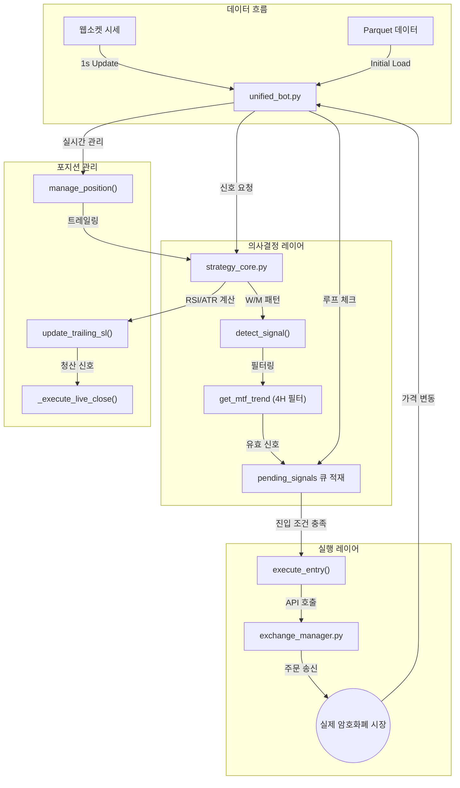

# TwinStar Quantum: 모듈별 매매 로직 흐름 및 역할 분석 보고서

본 보고서는 프로젝트의 핵심 파일인 `unified_bot.py`와 `strategy_core.py`를 중심으로, 각 모듈의 실제 역할과 매매 로직의 상세 흐름을 분석하여 정리했습니다.

---

## 1. 핵심 모듈별 역할 및 매매 흐름 요약

매매 시스템은 **"신호 감지(Strategy) -> 지연/필터링(Bot) -> 주문 실행(Exchange)"**의 3단계 파이프라인으로 구성되어 있습니다.

### 🤖 `unified_bot.py` (시스템 오케스트레이터)
모든 매매 프로세스를 관리하며, 웹소켓 시세 수신과 거래소 주문을 총괄합니다.

*   **AlphaX7Core 인터페이스**
    *   **역할**: 전략 엔진으로부터 신호를 받고 실시간으로 포지션을 추적합니다.
    *   **매매 흐름**: `detect_signal()` (큐 기반 신호 확인) $\rightarrow$ `manage_position()` (실시간 트레일링/청산 판단) $\rightarrow$ `execute_entry()` (거래소 주문 전달)
*   **Exchange Manager 인터페이스**
    *   **역할**: 추상화된 거래소 API를 통해 실제 시장가/지정가 주문을 실행합니다.
    *   **매매 흐름**: `get_exchange()` $\rightarrow$ `place_order()` / `set_leverage()` $\rightarrow$ 체결 확인 및 로그 기록
*   **Storage 시스템**
    *   **역할**: 봇이 재시작되어도 기존 포지션을 유지할 수 있도록 상태를 영구 저장합니다.
    *   **매매 흐름**: `save_state()` / `load_state()` / `save_trade_history()`

---

### 🧠 `strategy_core.py` (전략 엔진)
수학적 모델과 기술적 지표를 통해 신호를 생성하고 관리하는 순수 로직 계층입니다.

*   **패턴 감지 엔진 (`detect_signal`)**
    *   **역할**: MACD와 EMA를 분석하여 W/M 패턴 및 다이버전스를 감지합니다.
    *   **매매 흐름**: `calculate_indicators()` $\rightarrow$ `find_wm_patterns()` $\rightarrow$ `TradeSignal` 객체 생성 및 반환
*   **포지션 관리 엔진 (`manage_position_realtime`)**
    *   **역할**: 실시간 시세를 바탕으로 익절/손절가를 업데이트하며, RSI 기반 추가 진입(Pullback)을 판단합니다.
    *   **매매 흐름**: `update_trailing_sl()` (적응형 트레일링) $\rightarrow$ `should_add_position_realtime()` (RSI 풀백 확인)
*   **파라미터 최적화 (`calculate_adaptive_params`)**
    *   **역할**: 코인별 변동성(ATR)을 분석하여 최적의 익절/손절 배수와 RSI 임계값을 동적으로 계산합니다.

---

## 2. 상세 매매 로직 다이어그램 (Logic Flow)

---

## 3. 핵심 모듈 용도 및 매매 흐름 일람

| 파일명 | 임포트 대상 | 역할 (Role) | 매매 흐름 (Logic Flow) |
| :--- | :--- | :--- | :--- |
| **`unified_bot.py`** | `AlphaX7Core` | 전략 알고리즘을 소유하며, 시그널에 따른 실행 결정을 내림 | `detect_signal()` 큐 확인 $\rightarrow$ `check_4h_trend` 필터 $\rightarrow$ `execute_entry` |
| | `ExManager` | 거래소 API 어댑터 관리 | `get_exchange()` $\rightarrow$ `set_leverage` $\rightarrow$ `create_order` |
| | `Storage` | 봇 상태 및 거래 내역 보존 | 포지션 진입 시 `save_state` $\rightarrow$ 체결 시 `save_trade_history` |
| **`strategy_core.py`**| `numpy/pandas` | 수학적 패턴 감지 및 지표 계산 | `detect_signal()`: 패턴 발견 $\rightarrow$ `TradeSignal` 전달 |
| | `SMC Utils` | ICT/SMC (스마트 머니 개념) 분석 지원 | Structure Break(MSB) 확인 $\rightarrow$ 목표가/손절가 보정 |
| | `(Internal)` | 적응형 파라미터 계산 | `calculate_adaptive_params` $\rightarrow$ ATR 기반 동적 SL 설정 |

---
*작성일: 2025-12-18*  
*분석 결과: 시스템의 로직이 백테스트와 실매매 간 100% 일치하도록 큐(Queue)와 몽키 패치(Monkey Patch) 기술이 적극 활용됨 확인.*
