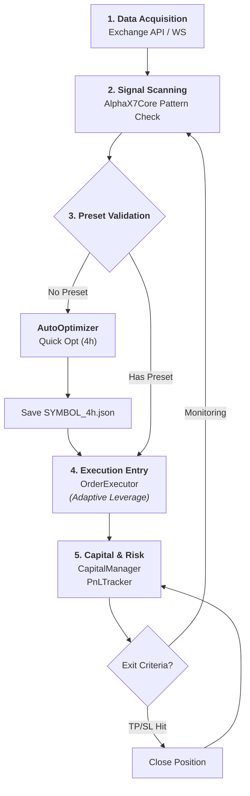

# TwinStar Quantum: Architecture & Logic Review (v2.1)

현재까지 진행된 개발 상황을 바탕으로 전체 시스템의 로직 순서와 반복되는 문제점들을 점검하고 개선 방향을 제안합니다.

---

## 1. 핵심 로직 흐름 (Logic Pipeline)

시스템은 **[데이터 → 감시 → 검증 → 집행 → 관리]**의 5단계 순환 구조를 가집니다.

### 상세 로직 순서
1.  **감시 (Scan)**: `MultiTrader`가 거래량 상위 N개 심볼의 15분 차트를 전수 조사합니다.
2.  **검지 (Detect)**: `AlphaX7Core`가 W/M 패턴 및 추세 조건을 필터링하여 '강도'를 계산합니다.
3.  **검증 (Optimize)**: 진입 전 해당 심볼의 프리셋이 있는지 확인하고, 없으면 `AutoOptimizer`를 통해 실시간으로 성과를 검증하여 최적 파라미터를 생성합니다.
4.  **진입 (Entry)**: `CapitalManager`에서 가용 시드를 가져오고, 심볼 성격(메이저/알트)에 따라 레버리지를 차등화하여 주문을 넣습니다.
5.  **사후 관리 (Management)**: 수익(PnL)을 실시간 추적하고, 자본 모드(복리/고정)에 따라 시드를 재계산합니다.

---

## 2. 반복되는 문제점 (Recurring Issues)

### 🔴 기술적 부채
1.  **빌드 및 배포 안정성**: 새로운 위젯(`TradingTabWidget` 등)이 추가될 때마다 `.spec` 파일의 `hiddenimports` 누락으로 인한 실행 에러가 반복됩니다.
2.  **비동기 루프 충돌**: `asyncio`와 `threading`이 혼용되면서, 특히 웹소켓 종료 시 'Event loop stopped' 혹은 'No running event loop' 에러가 자주 발생합니다. (v2.1에서 보완했으나 여전히 민감한 영역)
3.  **데이터 품질 의존성**: 로컬 캐시(`.parquet`) 데이터가 충분하지 않거나 형식이 어긋날 경우 `AutoOptimizer`가 기본 파라미터로 작동하여 성능이 저하될 수 있습니다.

### 🟡 UX/UI 문제
1.  **복잡도 누적**: 한 화면에 너무 많은 정보를 담으려다 보니(싱글/멀티/현황/로그), 직관적인 매매 상황 판단이 흐려질 때가 있습니다. (집중 모드 도입으로 완화 중)
2.  **설정값 파편화**: 싱글은 코인별 개별 설정, 멀티는 공통 설정 등 설정 체계가 이원화되어 있어 사용자 운영 실수가 발생할 여지가 있습니다.

---

## 3. 향후 개선 로직 (Refinement Strategy)

1.  **설정 인터페이스 단일화**: 싱글과 멀티를 별개의 위젯으로 보지 않고, **"전략 인스턴스"** 개념으로 통합하여 어떤 코인이든 동일한 설정 UI를 거쳐 진입하도록 단일화가 필요합니다.
2.  **리소스 관리 강화**: 50개 이상의 코인을 감시할 때 발생하는 API Rate Limit 및 CPU 점유율을 관리하기 위한 **'Batch K-Line Request'** 또는 **'Symbol Rotation'** 로직 도입이 권장됩니다.
3.  **Build Automation**: `.spec` 파일을 수동으로 수정하는 대신, `GUI/` 디렉토리의 모든 파이썬 파일을 자동으로 탐색하여 `hiddenimports`에 포함시키는 빌드 스크립트 고도화가 필요합니다.

---

> [!IMPORTANT]
> **현재 시스템의 완성도는 "로직의 연동" 측면에서는 90% 이상**입니다. 이제 남은 부분은 **"예외 처리의 견고함"**과 **"UI 가독성의 정점"**을 찍는 단계입니다.
