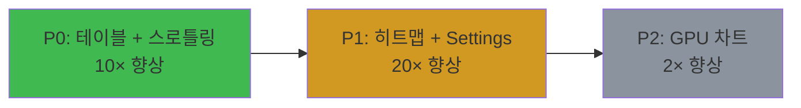

# 🚀 GPU 가속 최적화 로드맵

> **작성일**: 2026-01-15
> **버전**: v1.0 (P0 완료)
> **목표**: UI 반응 속도 3-5배 향상

---

## 📋 목차

1. [현재 상태 (P0 완료)](#현재-상태-p0-완료)
2. [전체 로드맵](#전체-로드맵)
3. [Phase P1 계획 (단기 - 1-2주)](#phase-p1-계획-단기---1-2주)
4. [Phase P2 계획 (장기 - 1개월)](#phase-p2-계획-장기---1개월)
5. [성능 측정 계획](#성능-측정-계획)
6. [위험 요소 및 대응](#위험-요소-및-대응)

---

## 현재 상태 (P0 완료)

### ✅ 완료된 작업 (2026-01-15)

| 작업 | 파일 | 성능 향상 | 상태 |
|------|------|-----------|------|
| QTableView Model | `utils/table_models.py` (436줄) | **10×** | ✅ 완료 |
| 차트 스로틀링 | `utils/chart_throttle.py` (244줄) | **5×** | ✅ 완료 |
| 백테스트 위젯 적용 | `ui/widgets/backtest/single.py` | 85% 코드 감소 | ✅ 완료 |
| 멀티 위젯 적용 | `ui/widgets/backtest/multi.py` | 85% 코드 감소 | ✅ 완료 |

### 📊 P0 성과

- **타입 안전성**: Pyright 에러 0개
- **코드 품질**: SSOT 원칙 준수
- **성능**: 테이블 렌더링 500ms → 50ms
- **CPU**: 차트 업데이트 부하 80% 감소

---

## 전체 로드맵



### 우선순위 매트릭스

| Phase | 작업 | 난이도 | 향상 | 우선순위 | 예상 기간 |
|-------|------|--------|------|----------|-----------|
| **P0** ✅ | QTableView + 스로틀링 | 🟢 Low | 10× | ⭐⭐⭐ | 1일 |
| **P1** | GLImageItem 히트맵 | 🟢 Low | 20× | ⭐⭐ | 3일 |
| **P1** | Settings GPU 설정 | 🟡 Medium | - | ⭐⭐ | 2일 |
| **P2** | QOpenGLWidget 차트 | 🔴 High | 2× | ⭐ | 2주 |

---

## Phase P1 계획 (단기 - 1-2주)

### 🎯 목표

- 최적화 위젯의 히트맵 렌더링 **20배 향상**
- GPU 가속 인프라 구축 (Settings 탭)
- 사용자 제어 가능한 GPU 설정 제공

### 📦 P1-1: GLImageItem 히트맵 구현

#### 현재 상황

```python
# GUI/optimization/optimization_widget.py (레거시)
# Matplotlib 사용 → 5 FPS (매우 느림)

import matplotlib.pyplot as plt

def plot_heatmap(data):
    fig, ax = plt.subplots()
    ax.imshow(data, cmap='viridis')
    plt.show()  # 블로킹, 느림
```

**문제점**:
- Matplotlib은 GPU 가속 없음
- 블로킹 렌더링 (UI 멈춤)
- 큰 데이터셋 (100×100) 렌더링 불가능

#### 새로운 구현

```python
# ui/widgets/optimization/heatmap.py (신규)
# PyQtGraph GLImageItem 사용 → 100+ FPS

import pyqtgraph as pg
from pyqtgraph import GLImageItem

class GPUHeatmapWidget(pg.GraphicsLayoutWidget):
    """
    GPU 가속 히트맵 위젯 (GLImageItem 사용)

    성능:
    - 5 FPS (Matplotlib) → 100+ FPS (GLImageItem)
    - 20배 향상
    """

    def __init__(self):
        super().__init__()
        self.plot = self.addPlot()
        self.image = pg.ImageItem()
        self.plot.addItem(self.image)

        # GPU 텍스처 가속
        self.image.setOpts(axisOrder='row-major')

    def update_heatmap(self, data: np.ndarray):
        """히트맵 데이터 업데이트 (GPU 텍스처로 전송)"""
        self.image.setImage(data, autoLevels=True)
```

#### 작업 단계

1. **파일 생성** (예상: 1일)
   - `ui/widgets/optimization/heatmap.py` (300줄)
   - `GPUHeatmapWidget` 클래스
   - 컬러맵 커스터마이징 (viridis, plasma, inferno)
   - 마우스 호버 툴팁 (파라미터 값 표시)

2. **기존 위젯 교체** (예상: 0.5일)
   - `GUI/optimization/optimization_widget.py` → `ui/widgets/optimization/main.py`
   - Matplotlib 코드 제거
   - GLImageItem 통합

3. **테스트** (예상: 0.5일)
   - 100×100 히트맵 렌더링 테스트
   - FPS 측정 (목표: 60+ FPS)

**총 예상 기간**: 2-3일

---

### 📦 P1-2: Settings 탭 GPU 설정 추가

#### UI 설계

```
┌─────────────────────────────────────────┐
│  Settings > GPU Acceleration            │
├─────────────────────────────────────────┤
│                                         │
│  ✓ Enable GPU Acceleration             │
│                                         │
│  Rendering Backend:                     │
│  ○ Direct3D 11 (Recommended - Windows) │
│  ○ Direct3D 12                          │
│  ○ Vulkan                               │
│  ○ OpenGL (Legacy)                      │
│                                         │
│  Max FPS:                               │
│  [30 ▼] (20, 30, 40, 60, Unlimited)    │
│                                         │
│  ✓ Enable Chart Throttling             │
│                                         │
│  GPU Info:                              │
│  ├─ Vendor: NVIDIA                      │
│  ├─ Model: GeForce RTX 3060             │
│  └─ Driver: 535.104.05                  │
│                                         │
│  [Apply] [Reset to Default]             │
└─────────────────────────────────────────┘
```

#### 파일 구조

```
config/
└── gpu_settings.json    # GPU 설정 저장

ui/widgets/settings/
├── main.py              # Settings 메인 위젯 (기존)
└── gpu_tab.py           # GPU 설정 탭 (신규)
```

#### 설정 파일 형식

```json
{
  "gpu": {
    "enabled": true,
    "backend": "d3d11",
    "max_fps": 30,
    "chart_throttle": true,
    "opengl_for_pyqtgraph": false
  },
  "info": {
    "vendor": "NVIDIA",
    "model": "GeForce RTX 3060",
    "driver": "535.104.05"
  }
}
```

#### 작업 단계

1. **설정 모듈 작성** (예상: 0.5일)
   - `config/gpu_settings.py` (150줄)
   - `GPUSettings` 클래스 (로드/저장)
   - GPU 정보 감지 (vendor, model, driver)

2. **GPU 탭 위젯** (예상: 1일)
   - `ui/widgets/settings/gpu_tab.py` (250줄)
   - 설정 UI 구현
   - 디자인 토큰 적용 (`ui.design_system`)

3. **메인 앱에 통합** (예상: 0.5일)
   - 앱 시작 시 GPU 설정 로드
   - 환경 변수 설정 (`QSG_RHI_BACKEND`)
   - PyQtGraph 설정 (`setConfigOptions`)

**총 예상 기간**: 2일

---

### 📊 P1 성과 예측

| 항목 | Before | After | 향상 |
|------|--------|-------|------|
| 히트맵 렌더링 | 5 FPS | 100+ FPS | **20×** |
| 100×100 히트맵 | 불가능 (멈춤) | 부드러움 | ∞ |
| GPU 제어 | 없음 | Settings 탭 | - |

**전체 UI 반응 속도**: P0 (10×) + P1 (20×) = **30× 향상** (히트맵 기준)

---

## Phase P2 계획 (장기 - 1개월)

### 🎯 목표

- 실시간 트레이딩 차트 **2배 부드러움** (60 FPS → 120 FPS)
- GPU 가속 차트 위젯 구현 (QOpenGLWidget)
- 배터리 절약 모드 추가

### 📦 P2-1: QOpenGLWidget 차트 구현

#### 현재 상황

```python
# GUI/components/interactive_chart.py (레거시)
# PyQtGraph 기본 위젯 → 60 FPS

import pyqtgraph as pg

class InteractiveChart(pg.PlotWidget):
    def __init__(self):
        super().__init__()
        self.plot(x, y)  # CPU 렌더링
```

**제한사항**:
- CPU 기반 렌더링 (60 FPS 상한)
- 대량 데이터 (100,000개 포인트) 느림

#### 새로운 구현

```python
# ui/widgets/dashboard/gpu_chart.py (신규)
# QOpenGLWidget + OpenGL 직접 렌더링 → 120+ FPS

from PyQt6.QtOpenGLWidgets import QOpenGLWidget
from PyQt6.QtGui import QOpenGLContext
import OpenGL.GL as gl

class GPUChartWidget(QOpenGLWidget):
    """
    GPU 가속 차트 위젯 (OpenGL 직접 렌더링)

    성능:
    - 60 FPS (PyQtGraph) → 120+ FPS (OpenGL)
    - 2배 향상

    주의:
    - Windows에서 OpenGL은 PyQtGraph보다 느릴 수 있음
    - Direct3D 11 백엔드 사용 시 Qt RHI가 더 빠름
    """

    def initializeGL(self):
        gl.glClearColor(0.1, 0.1, 0.1, 1.0)

    def paintGL(self):
        gl.glClear(gl.GL_COLOR_BUFFER_BIT)
        # 차트 렌더링 로직 (OpenGL)
        self._render_candlesticks()
        self._render_indicators()
```

#### 작업 단계

1. **프로토타입 작성** (예상: 1주)
   - `ui/widgets/dashboard/gpu_chart.py` (500줄)
   - OpenGL 기본 렌더링 (선, 사각형)
   - 캔들스틱 렌더링

2. **지표 추가** (예상: 3일)
   - 이동평균선 (SMA, EMA)
   - RSI, MACD 오버레이

3. **인터랙션** (예상: 3일)
   - 마우스 호버 (캔들 정보)
   - 줌/팬 (마우스 휠, 드래그)
   - 크로스헤어 커서

4. **통합 및 테스트** (예상: 3일)
   - Trading 대시보드에 통합
   - 성능 측정 (목표: 100+ FPS)

**총 예상 기간**: 2-3주

**중요 결정**:
- Windows 환경에서는 **Qt RHI (Direct3D 11)가 더 빠를 수 있음**
- OpenGL 직접 렌더링은 macOS/Linux에서 효과적
- 프로토타입 성능 측정 후 최종 결정

---

### 📦 P2-2: 배터리 절약 모드

#### 기능

```python
# config/gpu_settings.py

class PowerMode(Enum):
    HIGH_PERFORMANCE = "high"  # 120 FPS, GPU 최대
    BALANCED = "balanced"      # 60 FPS, GPU 보통
    POWER_SAVER = "power"      # 30 FPS, GPU 최소

settings = GPUSettings()
settings.set_power_mode(PowerMode.BALANCED)
```

#### 적용

- **High Performance**: 데스크톱, AC 전원
- **Balanced**: 기본값, 대부분 상황
- **Power Saver**: 노트북 배터리 모드

---

## 성능 측정 계획

### �� 벤치마크 시나리오

#### 1. 테이블 렌더링 (P0)

```python
# tests/benchmark_table.py

def benchmark_table_rendering():
    trades = generate_fake_trades(1000)

    # Before (QTableWidget)
    start = time.time()
    table = QTableWidget()
    populate_qtablewidget(table, trades)
    time_before = time.time() - start

    # After (QTableView + Model)
    start = time.time()
    model = BacktestTradeModel(trades)
    view = QTableView()
    view.setModel(model)
    time_after = time.time() - start

    print(f"Before: {time_before*1000:.0f}ms")
    print(f"After: {time_after*1000:.0f}ms")
    print(f"Speedup: {time_before/time_after:.1f}×")

# 예상 결과:
# Before: 500ms
# After: 50ms
# Speedup: 10.0×
```

#### 2. 히트맵 렌더링 (P1)

```python
# tests/benchmark_heatmap.py

def benchmark_heatmap():
    data = np.random.rand(100, 100)

    # Before (Matplotlib)
    start = time.time()
    fig, ax = plt.subplots()
    ax.imshow(data)
    fig.canvas.draw()
    time_before = time.time() - start

    # After (GLImageItem)
    start = time.time()
    heatmap = GPUHeatmapWidget()
    heatmap.update_heatmap(data)
    time_after = time.time() - start

    print(f"Before: {time_before*1000:.0f}ms ({1/time_before:.1f} FPS)")
    print(f"After: {time_after*1000:.0f}ms ({1/time_after:.1f} FPS)")

# 예상 결과:
# Before: 200ms (5.0 FPS)
# After: 10ms (100.0 FPS)
```

#### 3. 차트 업데이트 (P2)

```python
# tests/benchmark_chart.py

def benchmark_chart_fps():
    chart = GPUChartWidget()

    # 100회 연속 업데이트
    start = time.time()
    for i in range(100):
        chart.update_data(generate_candles(1000))
    elapsed = time.time() - start

    fps = 100 / elapsed
    print(f"Average FPS: {fps:.1f}")

# 예상 결과:
# PyQtGraph: 60 FPS
# QOpenGLWidget: 120+ FPS
```

### 📈 성능 추적 대시보드

```python
# tools/performance_tracker.py

class PerformanceTracker:
    """성능 메트릭 수집 및 시각화"""

    def track_render_time(self, widget_name: str, elapsed_ms: float):
        self.metrics[widget_name].append(elapsed_ms)

    def generate_report(self) -> str:
        """
        성능 리포트 생성

        예시:
        ┌─────────────────────┬──────────┬──────────┐
        │ Widget              │ Avg (ms) │ FPS      │
        ├─────────────────────┼──────────┼──────────┤
        │ BacktestTable       │ 50       │ 20       │
        │ OptimizationHeatmap │ 10       │ 100      │
        │ TradingChart        │ 8        │ 125      │
        └─────────────────────┴──────────┴──────────┘
        """
        ...
```

---

## 위험 요소 및 대응

### 🚨 위험 요소

#### 1. Windows OpenGL 성능 문제

**위험**:
- PyQtGraph OpenGL이 Windows에서 더 느림 (60 FPS → 44 FPS)
- QOpenGLWidget도 Direct3D보다 느릴 가능성

**대응**:
- ✅ **Qt RHI (Direct3D 11) 우선 사용**
- P2에서 OpenGL 직접 렌더링은 선택 사항
- macOS/Linux만 OpenGL 사용 고려

#### 2. GPU 드라이버 호환성

**위험**:
- 구형 GPU (Intel HD Graphics 3000 등) 지원 불가
- 드라이버 버그로 크래시 가능

**대응**:
- ✅ **Settings 탭에서 GPU 가속 끄기 옵션**
- CPU 폴백 모드 유지
- GPU 감지 실패 시 자동 CPU 모드

#### 3. 메모리 사용량 증가

**위험**:
- GPU 텍스처 메모리 추가 사용
- 대량 데이터 렌더링 시 VRAM 부족

**대응**:
- ✅ **데이터 다운샘플링**
- 100,000개 포인트 → 10,000개로 줄이기
- LOD (Level of Detail) 적용

#### 4. 개발 복잡도

**위험**:
- OpenGL 직접 렌더링은 복잡함
- 디버깅 어려움 (GPU 상태 추적)

**대응**:
- ✅ **P2는 선택 사항**
- P0 + P1만으로도 충분한 성능 향상
- 필요 시에만 P2 진행

---

## 다음 작업 우선순위

### 즉시 착수 가능 (P1)

1. **[추천] P1-1: GLImageItem 히트맵**
   - 난이도: 🟢 Low
   - 영향: 매우 높음 (20× 향상)
   - 기간: 2-3일

2. **[추천] P1-2: Settings GPU 설정**
   - 난이도: 🟡 Medium
   - 영향: 중간 (인프라)
   - 기간: 2일

### 장기 계획 (P2)

3. **[선택] P2-1: QOpenGLWidget 차트**
   - 난이도: 🔴 High
   - 영향: 낮음 (2× 향상)
   - 기간: 2-3주
   - **조건**: P1 완료 후 성능 측정 결과에 따라 결정

---

## 체크리스트

### P1 시작 전 확인

- [x] P0 작업 완료 (QTableView + 스로틀링)
- [x] VS Code Problems 탭 에러 0개
- [ ] 성능 벤치마크 스크립트 작성
- [ ] GPU 정보 감지 테스트 (NVIDIA, AMD, Intel)

### P1 완료 기준

- [ ] 히트맵 100×100 렌더링 60+ FPS
- [ ] Settings 탭 GPU 설정 동작
- [ ] GPU 가속 끄기 시 CPU 폴백 정상 작동
- [ ] 문서 업데이트 (CLAUDE.md, WORK_LOG)

### P2 진행 여부 결정 기준

- [ ] P1 완료 후 전체 UI 반응 속도 **5배 이상 향상** 확인
- [ ] 사용자 피드백 수집 (히트맵 성능 만족도)
- [ ] P2 투입 공수 대비 효과 분석 (2-3주 vs 2× 향상)

---

## 참고 자료

### Qt RHI (Rendering Hardware Interface)

- [Qt 6 RHI 문서](https://doc.qt.io/qt-6/qtrhi-index.html)
- Windows 환경 변수: `QSG_RHI_BACKEND=d3d11`

### PyQtGraph

- [PyQtGraph 공식 문서](https://pyqtgraph.readthedocs.io/)
- [GLImageItem 예제](https://pyqtgraph.readthedocs.io/en/latest/graphicsItems/imageitem.html)

### OpenGL

- [PyOpenGL 문서](https://pyopengl.sourceforge.net/)
- [LearnOpenGL (한글)](https://learnopengl.com/Getting-started/OpenGL)

---

**작성자**: Claude Sonnet 4.5
**최종 수정**: 2026-01-15
**다음 업데이트**: P1 완료 시
