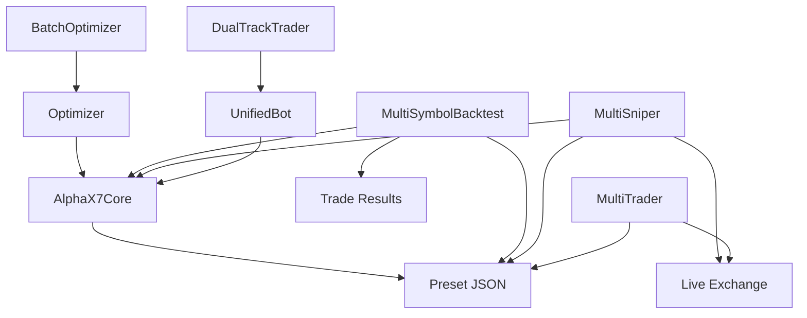

# 멀티 매매 시스템 로직 분석 보고서
**분석일:** 2026-01-05 23:30

---

## 📊 시스템 개요

```
┌─────────────────────────────────────────────────────────┐
│                멀티 매매 시스템 구조                     │
├─────────────────────────────────────────────────────────┤
│  1. 최적화 → 2. 백테스트 → 3. 실매매                    │
│                                                         │
│  [BatchOptimizer]    [MultiSymbolBacktest]              │
│        ↓                    ↓                           │
│   프리셋 JSON         검증 결과                          │
│        ↓                    ↓                           │
│              [MultiTrader/Sniper]                       │
│                      ↓                                  │
│                 실매매 실행                              │
└─────────────────────────────────────────────────────────┘
```

---

## 1️⃣ 최적화 (Optimization)

### BatchOptimizer (317 lines)
**파일:** `core/batch_optimizer.py`

**역할:** 거래소 전체 심볼 순차 최적화

**핵심 메서드:**
| 메서드 | 역할 |
| :--- | :--- |
| `run(resume)` | 배치 최적화 실행 |
| `fetch_symbols()` | 거래소 심볼 목록 조회 |
| `optimize_symbol()` | 단일 심볼 최적화 |
| `save_preset()` | 프리셋 JSON 저장 |
| `save_state()` | 진행 상태 저장 (중단 후 재개용) |

**필터 기준:**
- WinRate ≥ 70%
- MDD ≤ 20%
- Trades ≥ 30

**데이터 흐름:**
```
거래소 → 심볼 목록 → 개별 최적화 → 필터링 → 프리셋 저장
                                              ↓
                                    data/presets/{exchange}_{symbol}_{tf}.json
```

---

## 2️⃣ 백테스트 (Backtest)

### MultiSymbolBacktest (553 lines)
**파일:** `core/multi_symbol_backtest.py`

**역할:** 멀티 심볼 타임스탬프 기준 통합 백테스트

**핵심 메서드:**
| 메서드 | 역할 |
| :--- | :--- |
| `run()` | 백테스트 실행 |
| `collect_all_signals()` | 전체 심볼 시그널 수집 |
| `enter_position()` | 포지션 진입 |
| `check_exit_conditions()` | 청산 조건 체크 |
| `get_result()` | 결과 반환 |

**핵심 로직:**
- **동시 포지션 제한:** max_positions = 1
- **시간순 정렬:** 모든 심볼 시그널을 타임스탬프로 정렬
- **복리 적용:** 청산 후 자본에 PnL 반영

**데이터 구조:**
```python
Signal(symbol, timestamp, direction, entry_price, sl_price, atr, pattern_score)
Trade(symbol, direction, entry_time, exit_time, pnl_pct, exit_reason)
```

---

## 3️⃣ 실매매 (Live Trading)

### MultiCoinSniper (1718 lines) - Premium
**파일:** `core/multi_sniper.py`

**역할:** 50개 코인 실시간 스캔 → 타이밍 감지 → 자동 진입

**핵심 메서드:**
| 메서드 | 역할 |
| :--- | :--- |
| `initialize()` | Top 50 로드 + 백테스트 검증 |
| `start()/stop()` | 스나이퍼 제어 |
| `on_candle_close()` | 봉마감 시 분석 |
| `_calc_readiness()` | 매매 임박도 (0~100) |
| `_try_entry()` | 진입 시도 |

**심볼 선정:**
1. 거래량 Top N 조회
2. 개별 백테스트 검증
3. 승률 미달 제외

**시드 배분:** 거래량 비례

---

### MultiTrader (1183 lines) - Premium
**파일:** `core/multi_trader.py`

**역할:** 최적화 JSON 기반 로테이션 방식 멀티 트레이딩

**핵심 메서드:**
| 메서드 | 역할 |
| :--- | :--- |
| `initialize()` | 최적화 JSON 전체 로드 |
| `get_rotation_batch()` | 현재 라운드 구독 대상 |
| `rotate_subscriptions()` | 구독 로테이션 |
| `start_websocket()` | 웹소켓 연결 |

**로테이션 방식:**
- WS 제한 (bybit: 100, binance: 100)
- 1시간마다 구독 대상 순환
- 시드 균등 배분

---

### DualTrackTrader (182 lines)
**파일:** `core/dual_track_trader.py`

**역할:** 2-Track 실매매 (BTC 고정 + 알트 복리)

**핵심 메서드:**
| 메서드 | 역할 |
| :--- | :--- |
| `start_bot()` | 개별 심볼 봇 시작 |
| `check_entry_allowed()` | 진입 가능 여부 확인 |
| `on_entry_executed()` | 진입 시 자본 할당 |
| `on_exit_executed()` | 청산 시 복리 적용 |

**트랙 구조:**
- BTC Track: 고정 금액 (예: $100)
- ALT Track: 복리 적용
- 동시 포지션: BTC 1개 + ALT 1개

---

## 🔗 의존성 관계



---

## ⚙️ 설정 파라미터

| 파라미터 | 파일 | 기본값 | 설명 |
| :--- | :--- | :---: | :--- |
| `min_win_rate` | BatchOptimizer | 70% | 최소 승률 |
| `max_mdd` | BatchOptimizer | 20% | 최대 MDD |
| `min_trades` | BatchOptimizer | 30 | 최소 거래수 |
| `max_positions` | MultiSymbolBacktest | 1 | 최대 동시 포지션 |
| `leverage` | MultiSymbolBacktest | 5 | 레버리지 |
| `btc_fixed_usd` | DualTrackTrader | $100 | BTC 트랙 고정금액 |
