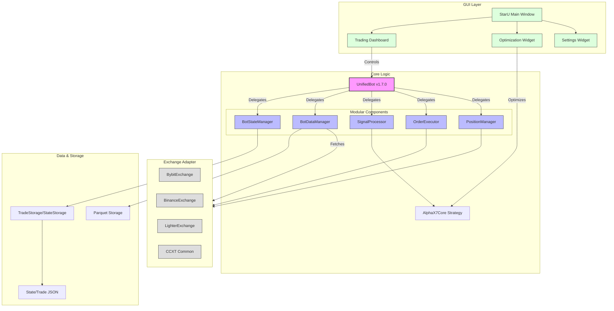

# TwinStar Quantum Project Report (v1.7.0)

이 문서는 TwinStar Quantum 프로젝트의 전체 구조, 아키텍처, 그리고 GUI 구성 내용을 상세히 기술합니다.

---

## 1. 아키텍처 다이어그램 (Architecture Diagram)

프로젝트는 `UnifiedBot`(v1.7.0 Modular)을 중심으로 5대 핵심 모듈이 로직을 분담하고 있으며, `GUI` 레이어와 `Exchange` 레이어 사이에서 중개 역할을 수행합니다.



---

## 2. 프로젝트 파일 트리 (Project Tree)

주요 파일 및 디렉토리 구조입니다. (불필요한 로그/캐시/임시파일 제외)

```text
C:\매매전략\
├── core/                       # [핵심 로직]
│   ├── unified_bot.py          # (Refactored) 5대 모듈 조율 및 메인 루프
│   ├── bot_state.py            # 상태 관리 (BotStateManager)
│   ├── data_manager.py         # 데이터 관리 (BotDataManager)
│   ├── signal_processor.py     # 신호 감지 (SignalProcessor)
│   ├── order_executor.py       # 주문 실행 (OrderExecutor)
│   ├── position_manager.py     # 포지션 관리 (PositionManager)
│   ├── strategy_core.py        # Alpha-X7 전략 구현체
│   ├── license_guard.py        # 라이선스 검증
│   └── optimizer.py            # 최적화 엔진
│
├── GUI/                        # [사용자 인터페이스]
│   ├── staru_main.py           # 메인 윈도우 진입점
│   ├── trading_dashboard.py    # 트레이딩 대시보드 (차트, 로그, 포지션)
│   ├── optimization_widget.py  # 최적화 설정 및 결과 표시
│   ├── settings_widget.py      # 봇 설정 관리
│   ├── login.py                # 로그인 화면
│   ├── styles.py               # PyQt 스타일시트
│   ├── constants.py            # GUI 상수 및 기본 설정
│   └── (Widgets...)            # 기타 기능별 위젯들
│
├── exchanges/                  # [거래소 어댑터]
│   ├── base_exchange.py        # 추상 기본 클래스
│   ├── bybit_exchange.py       # Bybit V5 API 연동
│   ├── binance_exchange.py     # Binance API 연동
│   └── lighter_exchange.py     # 경량 버전 어댑터
│
├── config/                     # [설정 관리]
│   ├── parameters.py           # 전략 파라미터 정의 (SSOT)
│   └── (Presets...)            # 심볼/TF별 파라미터 프리셋 JSON
│
├── storage/                    # [데이터 저장소]
│   ├── trade_storage.py        # 거래 기록 저장 관리
│   └── state_storage.py        # 봇 상태 영속성 관리
│
├── utils/                      # [유틸리티]
│   ├── preset_manager.py       # 프리셋 로드/저장
│   ├── indicators.py           # 보조지표 계산
│   └── helpers.py              # 공통 헬퍼 함수
│
├── locales/                    # [다국어 지원]
│   ├── ko.json                 # 한국어 리소스
│   └── en.json                 # 영어 리소스
│
├── docs/                       # [문서]
│   └── README_STRUCTURE.md     # 구조 설명서
│
├── test_bot_integration.py     # (New) 통합 테스트 스크립트
├── staru_clean.spec            # PyInstaller 빌드 명세서
└── version.json                # 버전 관리 파일
```

---

## 3. GUI 구성 및 표현 내용 (GUI Representation)

TwinStar Quantum의 GUI는 탭 기반의 직관적인 레이아웃을 제공합니다.

### 3.1 메인 윈도우 (StarU Main)
*   **상단 헤더**: 로고, 현재 버전(`v1.7.0`), 라이선스 티어, 남은 기간, 설정 버튼.
*   **네비게이션 탭**:
    1.  **Dashboard** (대시보드)
    2.  **Backtest** (백테스트 - *Legacy/Internal*)
    3.  **Optimization** (최적화)
    4.  **Settings** (설정)

### 3.2 트레이딩 대시보드 (Dashboard Tab)
실시간 매매 현황을 모니터링하고 제어하는 핵심 화면입니다.

*   **좌측 패널 (Status & Controls)**
    *   **Bot Control**: 시작/중지 버튼, 현재 상태 표시(Running/Stopped).
    *   **Symbol Selector**: 거래소 및 심볼(BTCUSDT 등) 선택 콤보박스.
    *   **Live Metrics**: 현재가, PnL(%), 실현 손익 등 주요 지표 카드 UI.
*   **중앙 패널 (Chart)**
    *   **Candlestick Chart**: 실시간 캔들 차트 (PyQtGraph 기반).
    *   **Indicators**: 이동평균선(MA), 볼린저 밴드 등 보조지표 오버레이.
    *   **Trade Markers**: 진입(Long/Short) 및 청산 지점 화살표 표시.
*   **우측 패널 (Logs & Details)**
    *   **Signal Status**: 현재 감지된 패턴, MTF 필터 상태, RSI 값 등 전략 조건 충족 여부 표시.
    *   **Log Console**: 봇의 실시간 동작 로그 출력 (Info/Error 등급별 색상 구분).
*   **하단 패널 (Positions)**
    *   **Active Position Table**: 현재 보유 중인 포지션 상세 정보 (진입가, 사이즈, 수량, 미실현손익).

### 3.3 최적화 위젯 (Optimization Tab)
전략 파라미터를 자동으로 튜닝하는 도구입니다.

*   **Sub-Tabs**:
    *   **Single Symbol**: 단일 심볼 최적화.
    *   **Multi/Batch**: (v1.7.0 New) 다중 심볼 일괄 최적화.
*   **Parameter Config**: 최적화할 파라미터 범위(Range) 설정 (ATR Multiplier, TP/SL 비율 등).
*   **Progress View**: 유전 알고리즘(GA) 진행 상황 프로그레스 바.
*   **Results**: 최적화 결과 테이블 (수익률 순 정렬), 파라미터 세트 적용 버튼.

### 3.4 설정 위젯 (Settings Tab)
*   **API Keys**: 거래소별 API 키 관리 (암호화 저장).
*   **Notification**: 텔레그램 봇 토큰 및 Chat ID 설정.
*   **Preferences**: 테마(Dark/Light), 언어(Korean/English), 알림 소리 설정.
