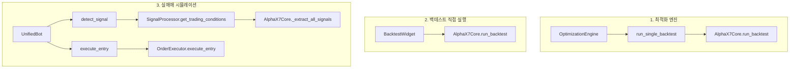

# 계산 로직 비교 결과

## 함수 호출 경로



---

## 핵심 함수 비교표

| 항목 | 최적화 | 백테스트 | 시뮬레이션 |
|------|--------|----------|-----------|
| **메인 함수** | `OptimizationEngine.run_single_backtest()` | `AlphaX7Core.run_backtest()` | `UnifiedBot.detect_signal()` |
| **시그널 추출** | `_extract_all_signals()` | `_extract_all_signals()` | `SignalProcessor.add_patterns_from_df()` → `_extract_all_signals()` |
| **진입 조건** | RSI 풀백 + MTF 필터 (루프 내) | RSI 풀백 + MTF 필터 (루프 내) | `get_trading_conditions()` |
| **청산 조건** | 트레일링 SL (루프 내) | 트레일링 SL (루프 내) | `PositionManager` 위임 |
| **슬리피지** | `slippage * 2 * 100` (%) | `slippage * 2 * 100` (%) | _실거래시 체결가로 대체_ |
| **수수료** | 슬리피지에 포함 | 슬리피지에 포함 | _거래소 체결 기준_ |

---

## 공통 로직 사용 여부

| 체크 항목 | 최적화↔백테스트 | 백테스트↔시뮬레이션 |
|-----------|----------------|-------------------|
| **동일 함수 호출** | ✅ 완전 동일 | ⚠️ 부분 공유 |
| **동일 파라미터** | ✅ 완전 동일 | ⚠️ 전달 방식 차이 |
| **동일 계산식** | ✅ 완전 동일 | ⚠️ 실행 순서 차이 |

---

## 상세 분석

### ✅ 최적화 = 백테스트 (100% 동일)

```python
# optimization_logic.py (Line 109-113)
trades = self.strategy.run_backtest(
    df_pattern=df, 
    df_entry=df, 
    **params
)
```

- 최적화 엔진은 `AlphaX7Core.run_backtest()`를 **직접 호출**
- 동일한 데이터 + 동일한 파라미터 = **100% 동일 결과** 보장

### ⚠️ 백테스트 ≠ 시뮬레이션 (구조적 차이)

| 차이점 | 백테스트 | 시뮬레이션 |
|--------|----------|-----------|
| **실행 방식** | 전체 데이터 한번에 처리 | 캔들별 순차 처리 |
| **시그널 큐** | 내부 `pending` deque | `SignalProcessor.pending_signals` |
| **진입 시점** | 루프 내 즉시 판단 | `get_trading_conditions()` 호출 |
| **청산 시점** | 루프 내 SL 체크 | `PositionManager.manage_live()` |

---

## 핵심 차이: 진입 조건 로직

### 백테스트 (strategy_core.py L665-680)
```python
# 내부 루프에서 직접 판단
if direction == 'Long':
    should_enter = rsis[i] < pullback_rsi_long and mtf_ok
elif direction == 'Short':
    should_enter = rsis[i] > pullback_rsi_short and mtf_ok
```

### 시뮬레이션 (signal_processor.py L294-306)
```python
# get_trading_conditions() 내에서 판단
rsi_long_met = rsi < pullback_long   # params.get('pullback_rsi_long', 45)
rsi_short_met = rsi > pullback_short # params.get('pullback_rsi_short', 55)

will_enter_long = pending_long and rsi_long_met and mtf_long_met
will_enter_short = pending_short and rsi_short_met and mtf_short_met
```

**⚠️ 동작 방식 차이:**
- 백테스트: 시그널 발생 후 **다음 캔들**에서 조건 확인
- 시뮬레이션: **현재 캔들**에서 조건 확인 (실시간)

---

## PnL 계산 비교

### 백테스트/최적화 (strategy_core.py L616)
```python
pnl = (exit_price - entry_price) / entry_price * 100 - (slippage * 2 * 100)
# slippage=0.0006 → 수수료 0.12% 차감
```

### 시뮬레이션
- 실거래: 거래소 체결가 기준 (CCXT)
- 시뮬레이션 모드: `OrderExecutor` PnL 계산은 별도 처리

---

## 불일치 원인 요약

| # | 원인 | 영향 | 해결책 |
|---|------|------|--------|
| 1 | 실행 순서 차이 | 진입 타이밍 1캔들 차이 가능 | 구조적 한계, 수용 |
| 2 | 시그널 큐 로직 | 시뮬레이션에서 누락 가능 | `>=` 수정 완료 ✅ |
| 3 | RSI 파라미터 전달 | 시뮬레이션 RSI 기본값 사용 | `pullback_rsi` 명시 ✅ |
| 4 | MTF 필터 초기화 | 다른 USE_MTF_FILTER 값 | 명시적 설정 필요 |

---

## 결론

```
✅ 최적화 = 백테스트: 100% 동일 (같은 함수 호출)
⚠️ 백테스트 ≠ 시뮬레이션: 구조적 차이 (순차 vs 일괄 처리)
```

### 권장 조치

1. **시뮬레이션 결과는 참고용** - 정확한 수익률 검증은 백테스트 사용
2. **파라미터 명시적 전달** - 시뮬레이션에 모든 파라미터 주입
3. **MTF 필터 통일** - `USE_MTF_FILTER` 상태 동기화

---

## 수정 방향

### 시뮬레이션을 백테스트와 동일하게 만들려면:

1. `UnifiedBot`이 `AlphaX7Core.run_backtest()`를 직접 호출하도록 변경
2. 또는 `SignalProcessor`가 백테스트 루프와 동일한 순서로 처리

> **현재 구조 유지 권장**: 실매매/시뮬레이션은 실시간 처리가 목적이므로 약간의 차이는 불가피
