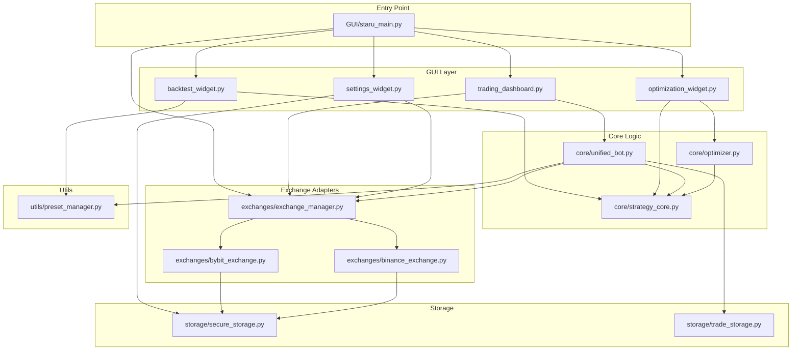

# TwinStar Quantum - Project Architecture Diagram
# Updated: 2025-12-18

## 📁 폴더 구조

```
c:\매매전략\
│
├── 🎯 Entry Point
│   └── GUI/staru_main.py              # 앱 진입점, 로그인, 메인 윈도우
│
├── 🖥️ GUI Layer
│   └── GUI/
│       ├── staru_main.py              # 메인 윈도우, 탭 관리
│       ├── trading_dashboard.py       # 실시간 트레이딩 컨트롤
│       ├── backtest_widget.py         # 백테스트 UI
│       ├── optimization_widget.py     # 파라미터 최적화 UI
│       ├── settings_widget.py         # API 키 설정
│       ├── login_dialog.py            # 로그인 다이얼로그
│       ├── data_manager.py            # 데이터 다운로드/캐시
│       ├── constants.py               # 거래소 정보, 상수
│       ├── crypto_manager.py          # API 키 암호화
│       └── ... (40+ widgets)
│
├── ⚙️ Core Logic Layer
│   └── core/
│       ├── __init__.py                # 패키지 초기화
│       ├── strategy_core.py           # AlphaX7Core 전략 엔진
│       ├── unified_bot.py             # 통합 봇 (라이브/백테스트)
│       └── optimizer.py               # 파라미터 그리드 최적화
│
├── 🔌 Exchange Adapters Layer  
│   └── exchanges/
│       ├── __init__.py
│       ├── exchange_manager.py        # 거래소 연결 관리
│       ├── base_exchange.py           # 추상 베이스 클래스
│       ├── bybit_exchange.py          # Bybit 어댑터
│       ├── binance_exchange.py        # Binance 어댑터
│       ├── okx_exchange.py            # OKX 어댑터
│       ├── bitget_exchange.py         # Bitget 어댑터
│       ├── upbit_exchange.py          # Upbit 어댑터
│       ├── bithumb_exchange.py        # Bithumb 어댑터
│       ├── lighter_exchange.py        # Lighter DEX 어댑터
│       └── bingx_exchange.py          # BingX 어댑터
│
├── 💾 Storage Layer
│   └── storage/
│       ├── __init__.py
│       ├── secure_storage.py          # API 키 암호화 저장
│       ├── trade_storage.py           # 거래 기록 저장
│       ├── state_storage.py           # 봇 상태 저장
│       └── trade_history.py           # 거래 이력 조회
│
├── 🛠️ Utilities Layer
│   └── utils/
│       ├── __init__.py
│       ├── preset_manager.py          # 프리셋 저장/로드
│       └── bot_data_utils.py          # 봇 데이터 유틸
│
├── 📊 Strategies Layer
│   └── strategies/
│       ├── __init__.py
│       ├── wm_pattern_strategy.py     # W/M 패턴 전략
│       ├── strategy_loader.py         # 전략 로더
│       └── parameter_optimizer.py     # 파라미터 최적화
│
├── 📁 Data & Config
│   ├── config/
│   │   ├── presets/                   # 전략 프리셋 JSON
│   │   └── telegram.json              # 텔레그램 설정
│   ├── data/
│   │   └── cache/                     # 캔들 데이터 캐시
│   └── logs/                          # 로그 파일
│
└── 🔧 Root Utilities
    ├── paths.py                       # 경로 관리 (EXE 호환)
    ├── license_manager.py             # 라이센스 검증
    ├── telegram_notifier.py           # 텔레그램 알림
    ├── indicator_generator.py         # 기술적 지표 계산
    └── staru_clean.spec               # PyInstaller 빌드 설정
```

---

## 🔗 Import 의존성 다이어그램



---

## 📦 모듈별 Import 패턴

| 모듈 | Import 경로 |
|------|------------|
| AlphaX7Core | `from core.strategy_core import AlphaX7Core` |
| UnifiedBot | `from core.unified_bot import UnifiedBot` |
| BacktestOptimizer | `from core.optimizer import BacktestOptimizer` |
| ExchangeManager | `from exchanges.exchange_manager import get_exchange` |
| PresetManager | `from utils.preset_manager import get_preset_manager` |
| SecureStorage | `from storage.secure_storage import SecureKeyStorage` |
| TradeStorage | `from storage.trade_storage import TradeStorage` |

---

## 🚀 실행 흐름

```
1. staru_main.py 시작
   ├── paths.py 초기화 (EXE 경로 설정)
   ├── 라이센스 검증
   └── 로그인 다이얼로그
   
2. 메인 윈도우 로드
   ├── TradingDashboard (실시간 거래)
   ├── BacktestWidget (백테스트)
   ├── OptimizationWidget (최적화)
   └── SettingsWidget (설정)

3. 봇 시작 시
   ├── exchange_manager.connect_exchange()
   ├── UnifiedBot 생성
   ├── AlphaX7Core.detect_signal()
   └── 거래 실행/로그
```
